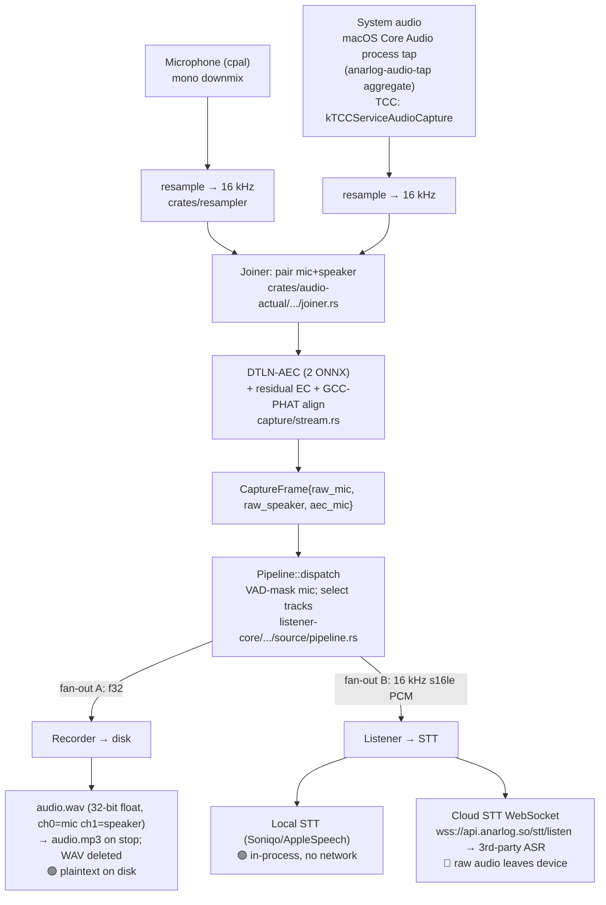
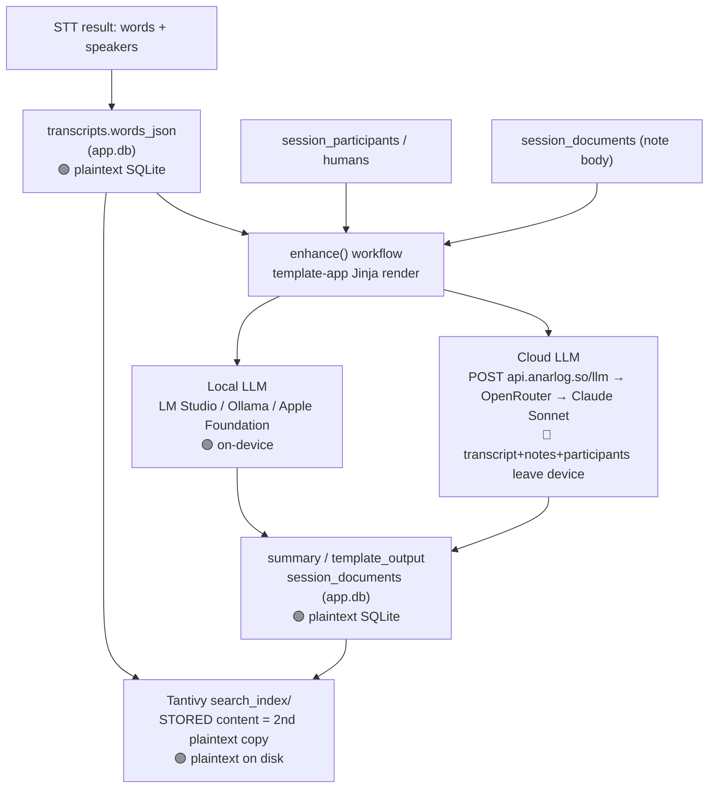
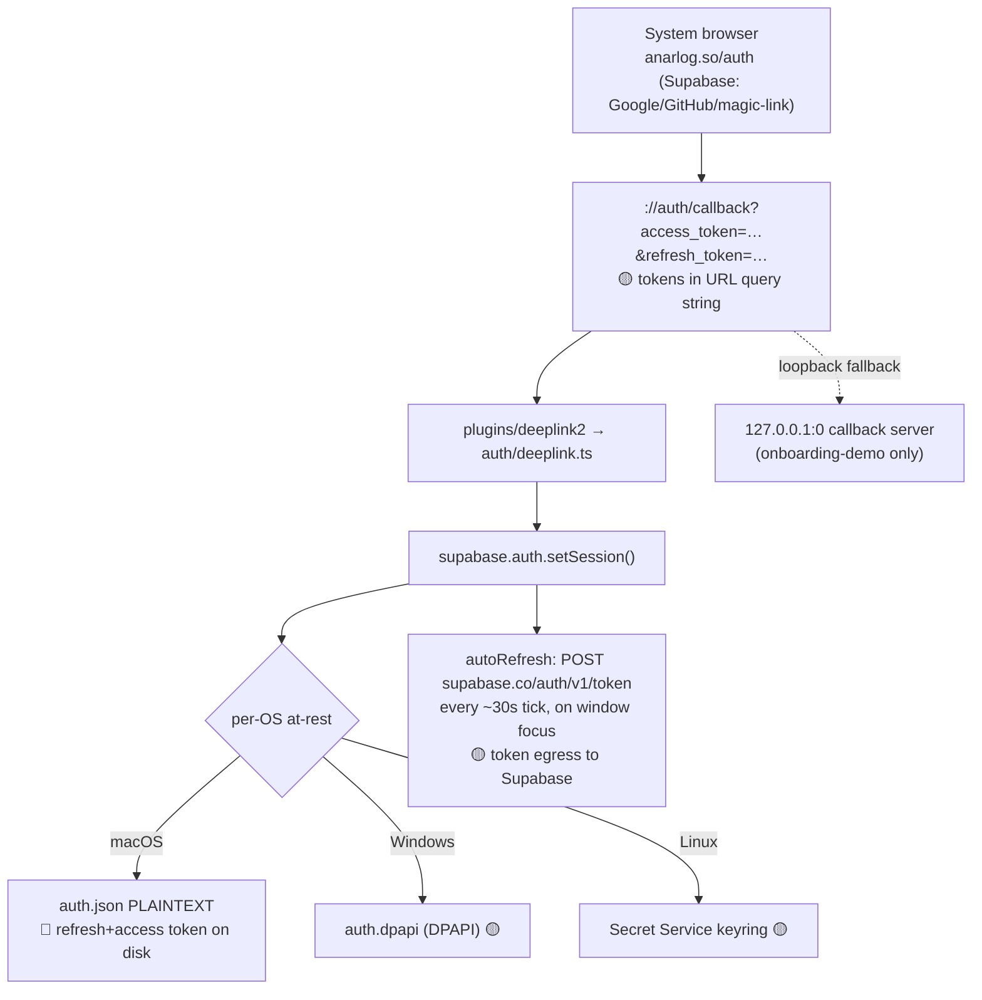
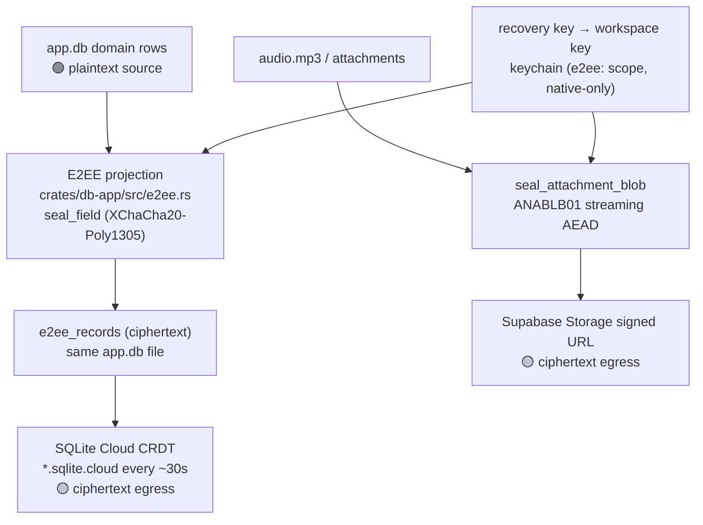
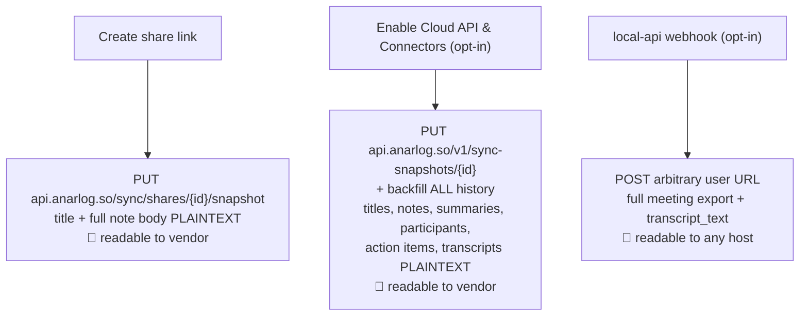

# DATA_FLOW_MAP.md

How PHI-class data moves through upstream **Anarlog** at commit `08aad83`. Read-only analysis; paths are upstream-relative.

**PHI-class data** for this system: **audio recordings, transcripts, summaries/notes, participant identities, calendar/meeting context, and — as credentials that unlock all of it — OAuth/session tokens and provider API keys.** (Embeddings are listed as sensitive in the target architecture; note that **Anarlog currently has no text-embedding/vector pipeline** — see §6.)

Each flow below is tagged with its **on-disk residency**, its **network egress**, and whether it is **default-on** or opt-in. Legend: 🟢 stays local · 🟡 leaves device as ciphertext / re-identifying metadata · 🔴 leaves device as readable PHI.

---

## 1. Audio capture → memory → disk → STT

**Key citations:**
- Capture rate fixed at 16 kHz mono: `crates/listener-core/src/actors/mod.rs:13-16`; chunking `crates/audio-utils/src/lib.rs:340-346`.
- macOS system-audio tap: `crates/audio-actual/src/speaker/macos.rs:54-79` (global mono tap → private aggregate device); permission is `kTCCServiceAudioCapture` (`crates/tcc/src/lib.rs`), *not* screen recording.
- Fan-out to recorder + listener: `crates/listener-core/src/actors/source/pipeline.rs:108-197`.
- Disk writer: `crates/listener-core/src/actors/recorder/disk.rs:34-148` (WAV spec, mp3 transcode, WAV delete). **Debug/`LISTENER_DEBUG` leak:** un-cleaned `audio_mic.wav`/`audio_spk.wav` (`disk.rs:199-204`).
- On-disk location: `<vault_base>/sessions/[<folder>/]<session_id>/audio.{mp3,wav,ogg}`; vault base = `dirs::data_dir()/anarlog` unless overridden (`crates/storage/src/vault/path.rs`; `CHAR_VAULT_BASE` env).
- Cloud STT WebSocket: `crates/owhisper-client/src/live.rs:391-520`; proxy domains `["hyprnote.com","char.com","anarlog.so"]` (`crates/owhisper-client/src/adapter/mod.rs:306`).

**Residency & egress.** Raw audio is **🟢 plaintext on disk** by default, retained **`forever`** (`apps/desktop/src/settings/schema.ts:82-85`). In **local STT** mode it never leaves the machine. In **cloud STT** mode (the post-onboarding default — see §7) the 16 kHz PCM stream is **🔴 raw PHI egress** to `wss://api.anarlog.so/stt/listen`, which relays it to Deepgram/Soniox/AssemblyAI/etc. on Anarlog's server-side keys (`crates/transcribe-proxy/src/relay/handler.rs`, `env.rs:6-31`; default upstream provider Deepgram, `config.rs:42`). Batch mode can additionally upload the recorded file to Anarlog's Supabase Storage `audio-files` bucket via a 1-hour signed URL (`crates/transcribe-proxy/src/routes/batch/async_callback.rs:65`).

## 2. Transcript → storage → summary/LLM

**Key citations:**
- Transcript rows: `crates/db-app/migrations/20260710223922_canonical_data_model.sql:78-97` (`transcripts.words_json`, `speaker_hints_json`, `audio_attachment_id`).
- Summaries/notes: `session_documents` (`kind ∈ note/summary/template_output/meeting_chat`), stored as ProseMirror JSON (`…canonical_data_model.sql:59-77`); write path `apps/desktop/src/services/enhancer/storage.ts:245-258`.
- Enhance workflow inputs (full transcript + participant list + notes + optional note images): `apps/desktop/src/store/zustand/ai-task/task-configs/enhance-workflow.ts:39-110`; template `crates/template-app/assets/enhance.user.md.jinja`.
- Cloud LLM proxy: `crates/llm-proxy/src/provider/openrouter.rs:12` (→ `openrouter.ai/api/v1/chat/completions`), default model `~anthropic/claude-sonnet-latest` (`crates/llm-proxy/src/model.rs:10,46-74`); the client's requested model is stripped and replaced server-side.
- Search index content: `apps/desktop/src-tauri/src/search_index.rs:255-354` (concatenates note + summaries + meeting-chat + `words_json`); `STORED` fields `plugins/tantivy/src/schema.rs:29-35`; location `<vault_base>/search_index/`.

**Residency & egress.** Transcripts and summaries are **🟢 plaintext in `app.db`** and **duplicated plaintext in the Tantivy index**. In **local LLM** mode, summarization is on-device. In **cloud LLM** mode (the `anarlog/Auto` default) the **full transcript + participant names + note bodies + optional images** are **🔴 PHI egress** to `api.anarlog.so/llm` → OpenRouter → Anthropic.

## 3. OAuth / session tokens

**Key citations:**
- Sign-in handoff: `apps/desktop/src/auth/context.tsx:709-727`; web-side session mint + callback URL `apps/web/src/lib/desktop-auth-handoff.ts:7-21` (**tokens in query string**).
- Storage backend selection: `plugins/auth/src/lib.rs:52-67`. **macOS falls through to plaintext `AuthStore::load/atomic_save`** (`crates/supabase-auth/src/client/store.rs:12-14,84-93`) at `<app_local_data_dir>/auth.json` (`plugins/auth/src/migrate.rs:155-161`). Windows shreds its plaintext copy (`migrate.rs:130-152`); macOS never does.
- Renderer reachability: the `auth` plugin exposes `get_item`/`set_item` to the webview (`capabilities/default.json` → `auth:default`); Supabase storage adapter at `apps/desktop/src/auth/client.ts:15-33`.
- No client-side JWT signature verification (`Claims::decode_insecure`, `crates/supabase-auth/src/claims/mod.rs:69-82`); verification is server-side only.

**Residency & egress.** Session tokens are **🔴 plaintext on disk on macOS** (the primary target platform) and **🟡 re-identifying egress** to Supabase on every refresh. The renderer can read them directly. Provider **API keys** live in the keychain but are **renderer-readable** (`plugins/store2` fences only the `e2ee:` prefix) and are passed back into capture params as plaintext.

## 4. Cross-device sync (CloudSync + attachments)

**Key citations:**
- Only `e2ee_records` replicates (all domain tables `enabled:false`): `crates/db-app/src/cloudsync.rs:165-190`; asserted `apps/desktop/src-tauri/src/db.rs:162-164`.
- Field sealing: `crates/e2ee/src/lib.rs:154-200`; **the plaintext source rows remain in the same `app.db`** next to the ciphertext.
- Attachment sealing before upload: `plugins/attachment-sync/src/runtime.rs:300-316`; container `crates/e2ee/src/blob.rs:14-35` (XChaCha20-Poly1305, 4 MiB chunks); ciphertext staging wiped on launch.
- Gate: `cloud_sync_enabled` defaults **`true`** (`apps/desktop/src/settings/schema.ts:122-126`) but hard-requires recovery-key setup first (`plugins/db/src/commands.rs:296-301`) and a signed-in **paid** account.

**Residency & egress.** CloudSync and attachment backup are **🟡 ciphertext egress** — the vendor cannot read them (recovery-key-derived keys, fenced from the renderer). This is the one genuinely privacy-preserving cloud path. **Important caveat:** it protects the *replica*, **not the local disk** — the source rows stay plaintext (§5).

## 5. The "readable to vendor" paths (privacy-story exceptions)

**Key citations:**
- Share snapshot is plaintext: `apps/desktop/src/session-sharing/client.ts:654-680`.
- Cloud API upload: `apps/desktop/src/cloud-api/client.ts:246-257` → `public.api_session_snapshots.content_json jsonb` (`supabase/migrations/20260728130000_cloud_api.sql:8-33`); opt-in default `false`; documented in `docs/data-and-privacy.mdx:22` and `docs/reference/api-cloud.mdx`.
- local-api webhook payload includes full export + concatenated `transcript_text`: `plugins/local-api/src/dispatch.rs:39-55` (HMAC-signed, off by default).

**Residency & egress.** These are **🔴 readable PHI egress** to the vendor (share/Cloud-API) or to an arbitrary host (webhook). All are opt-in, but the **share** path is easy to reach and its plaintext nature contrasts with the "Anarlog cannot read them" framing users see for CloudSync.

## 6. Embeddings / semantic memory — currently absent

The target architecture lists **embeddings** as sensitive data that Rust must own. In upstream Anarlog **there is no text-embedding, vector, or RAG pipeline**:
- `plugins/tantivy` is BM25 full-text only — no vectors (`plugins/tantivy/src/schema.rs:19-39`).
- `crates/memory` is a 26-line `MemoryId` newtype stub with no dependents.
- `crates/embedding` is a 256-dim **speaker** embedding (audio, for diarization), not text; also orphaned.
- "Semantic" retrieval is done by handing text to the LLM (`crates/template-app/assets/tool.search-sessions.md.jinja`).

**Implication for the refactor:** any future embedding/semantic-memory feature is greenfield and must be built Rust-owned, on-device, from an administrator-approved local embedding model — never routed to a cloud embedding API for PHI. This is called out in `REFACTOR_PLAN.md`.

## 7. Default configuration — the decisive flow

The single most consequential data-flow fact: **the shipped default sends PHI to the cloud.**

- Onboarding **auto-starts a Pro trial** for every signed-in user (`apps/desktop/src/onboarding/account/trial.tsx:86`).
- Trial/billing changes call `configurePaidSettings()`, which sets `current_stt_provider="anarlog"`, `current_stt_model="cloud"`, `current_llm_provider="anarlog"`, `current_llm_model="Auto"` (`apps/desktop/src/shared/config/configure-paid-settings.ts:11-19`).
- There is **no schema default** for these (`packages/store/src/zod.ts:311-314` are optional); the UI force-sorts `anarlog` to position 0 and badges it "Recommended" (`apps/desktop/src/settings/ai/shared/sort-providers.ts:11-12`).

So a fresh signed-in user lands on **cloud STT (audio egress) + cloud LLM (transcript egress)** with no distinct consent step, and merely *upgrading to Pro* reroutes a previously-local user's audio and notes off-device. Inverting this — local-only by default, cloud AI reachable only for explicitly nonclinical workflows under administrator policy — is a central refactor objective.

## 8. Consolidated PHI residency table

| Data | On disk (default) | Encrypted at rest? | Default network egress | Opt-in network egress |
|---|---|---|---|---|
| Raw audio (`audio.mp3`/`.wav`) | `<vault>/sessions/<id>/` | **No** 🔴 | Cloud STT stream (post-onboarding default) 🔴 | Batch upload to Anarlog Storage 🟡; attachment backup (E2EE) 🟡 |
| Transcript (`words_json`) | `app.db` + Tantivy index | **No** 🔴 | Produced locally; cloud STT returns it | CloudSync (E2EE) 🟡; Cloud API (plaintext) 🔴 |
| Summary / notes | `app.db` + Tantivy index | **No** 🔴 | Cloud LLM (post-onboarding default) 🔴 | Share snapshot (plaintext) 🔴; CloudSync (E2EE) 🟡; Cloud API (plaintext) 🔴 |
| Participants / contacts | `app.db` | **No** 🔴 | Sent to cloud LLM with transcript 🔴 | Cloud API (plaintext) 🔴 |
| Calendar / events | `app.db` | **No** 🔴 | Google/Outlook via Nango proxy through `api.anarlog.so` 🔴 (Apple Calendar 🟢 local) | — |
| Embeddings | — (none exist) | n/a | none | none |
| OAuth/session tokens | `auth.json` (macOS **plaintext**) | **No on macOS** 🔴 | Supabase refresh 🟡 | — |
| Provider API keys | keychain (renderer-readable) | keychain 🟡 | sent to chosen provider 🟡 | — |

**Reading of the table:** in the shipped default, **every PHI row except embeddings (which don't exist) is plaintext on disk, and audio + transcript + summary + calendar all have a default cloud egress path.** The HIPAA-first target requires: every row encrypted at rest under an OS-keychain-wrapped key that Rust alone holds; zero default cloud egress for PHI; Google Workspace as the durable record; and cloud AI confined to nonclinical workflows. The component-by-component plan to get there is in `REFACTOR_PLAN.md`.
